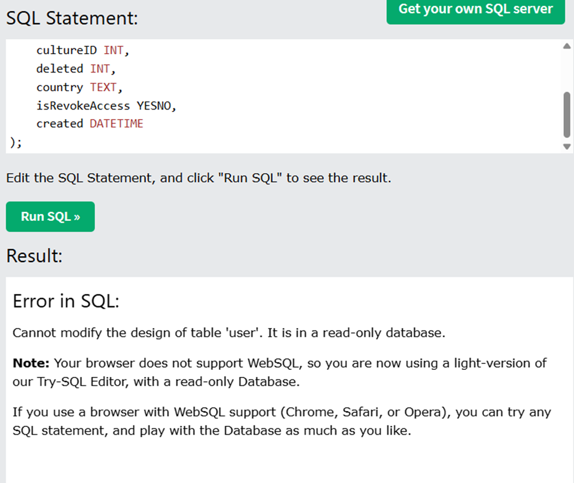

## Analysis

From the screenshots, we can see that the database was initially client-side, utilizing WebSQL. However, since WebSQL has been deprecated for some time, newer browsers (including mine) no longer support this API. As a result, the requests now performed on server-side database with read-only access. To regain access to the client-based database API, I installed **Chrome version 56**.

## Solution

### 3.1

**initQuery.js** - I am using this console script for creating tables and inserting data to avoid multiple calls inside of GUI (and for diversity of approaches).

### 3.2

SELECT g.name
FROM `group` g
LEFT JOIN groupMembership gm ON g.id = gm.groupID
WHERE g.name LIKE 'TEST-%' AND gm.userID IS NULL;

### 3.3

SELECT u.firstName, u.lastName
FROM user u
WHERE u.firstName = 'Victor'
AND NOT EXISTS (
SELECT 1
FROM groupMembership gm
JOIN `group` g ON gm.groupID = g.id
WHERE gm.userID = u.id AND g.name LIKE 'TEST-%'
);

<!--
SELECT u.firstName, u.lastName
FROM user u
LEFT JOIN groupMembership gm ON gm.userID = u.id
LEFT JOIN `group` g ON gm.groupID = g.id AND g.name LIKE 'TEST-%'
WHERE u.firstName = 'Victor' AND g.id IS NULL; -->

### 3.4

SELECT u.firstName, u.lastName, g.name
FROM user u
JOIN groupMembership gm ON u.id = gm.userID
JOIN `group` g ON gm.groupID = g.id
WHERE u.created < g.created;
